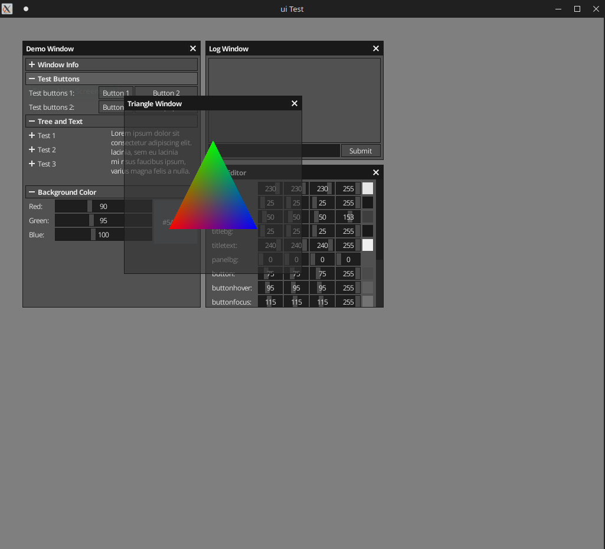

# NeoCogi's core libraries
 

A repo containing open source NeoCogi libraries:

- [x] Renderer
- [x] Rendering Helpers
- [x] Pass as the unit of rendering: a pass record both updates and draw commands
- [x] Arc \<Resource\> & Arc\<Mutex\<Driver\>\>
- [ ] Pixel uniform (example)
- [ ] Pixel readback (example)
- [ ] Partial texture updates: Not sure how wise it is to support it
- [ ] Stall detection on resource update commands (guard with a mutex?)
- [x] Immediate mode UI
- [x] UI Examples
- [x] Direct bypass rendering commands

## License

BSD-3-Clause license
